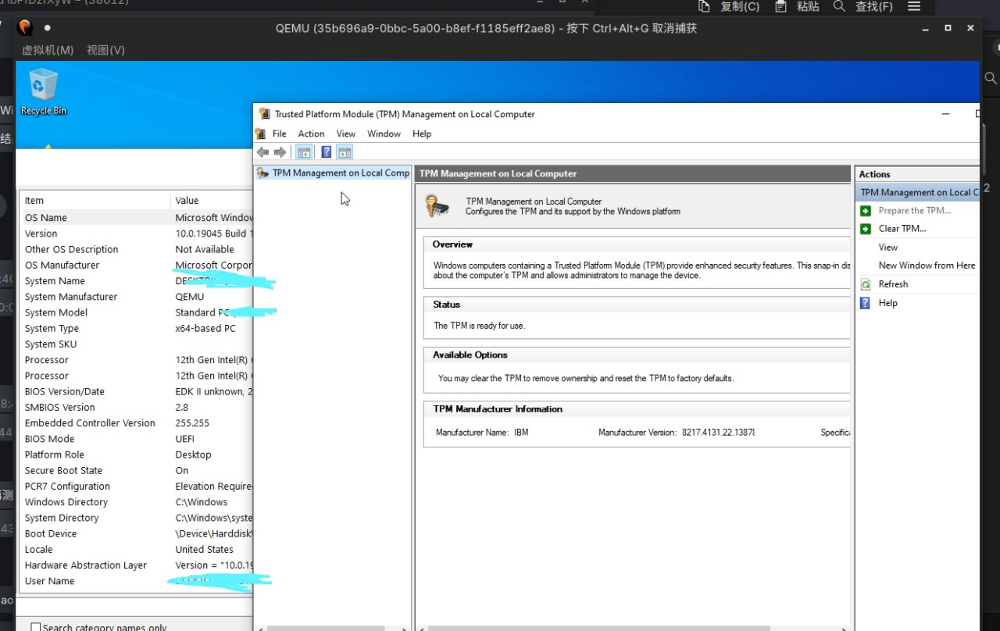

## 选项

从 Debian `ovmf` 提取 `OVMF_VARS_4M.ms.fd` [^0]，使用任意发行版提供的 `OVMF_CODE.secboot.4m.fd` ：

```bash
qemu ... \
  -drive if=pflash,format=raw,readonly=on,file=OVMF_CODE.fd \
  -drive if=pflash,format=raw,file=OVMF_VARS.ms.fd \
  -machine pc-q35-8.2
```

其中 `-machine` 是指定一种支持 SecureBoot 的机器型号

## 效果



[^0]: https://bbs.archlinux.org/viewtopic.php?id=275691
